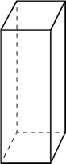

# problem #1

Bob lives in Hooblaboobla village and he loves his cottage. In this village every property is square-shaped. 

Unfortunately, nowadays the residents are having trouble with the hairy puff puffs as they always eat their home-grown vegetables.
Bob decided to start a fence-building business to keep the puff puffs away.

## task #1
Write a program that gets the length of one side of the property from the standard input (in meters).

Then, print to the standard output how many meters of fence bob needs to lay around his property.

an example run:
```
Input:	length of one side (m) = 10
Output:	fence needed for the property (m): 40
```

## task #2

The fence consists of cuboid-shaped steel pieces. Modify the program so it gets the width, height and length of one piece from the standard input, in centimeters.

Then, print to the standard output the total number of pieces needed for the whole fence.

an example run:

```
Input:	length of one side (m) = 10
Output:	fence needed for the property (m): 40
Input:	width (cm) = 20
Input:	length (cm) = 25
Input:	height (cm) = 175
```
